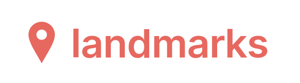
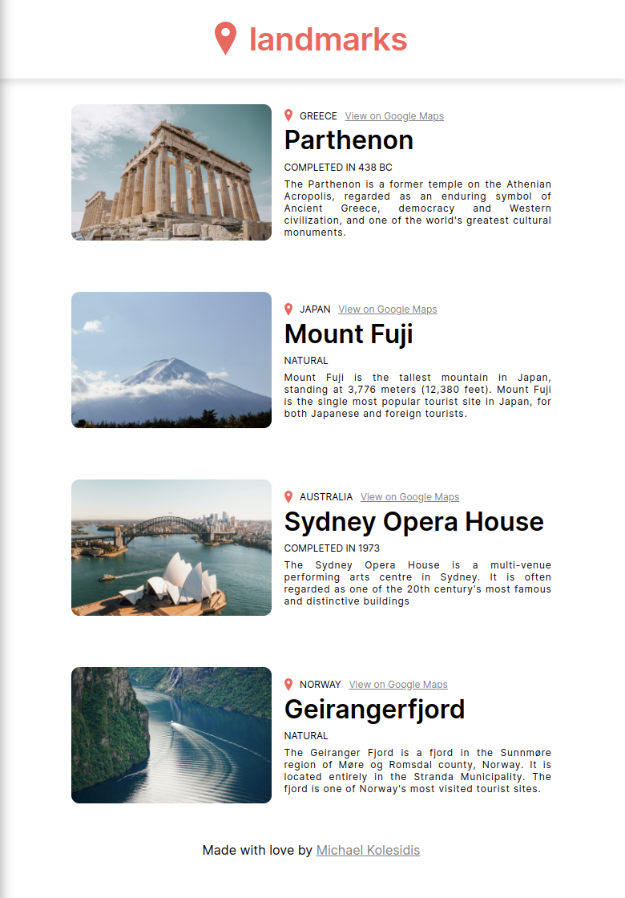
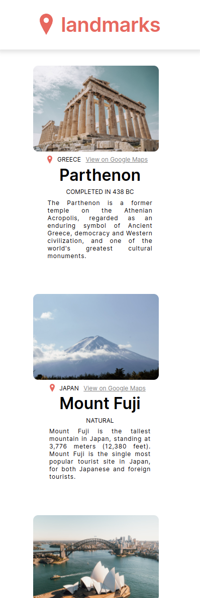

  

 

<h3 align="center">A static page showing landmarks around the globe </h3>

 
 

<h3 align="center"><a href="https://react-landmarks.netlify.app/">Try me!</a></h3>

## Technologies Used

&nbsp;&nbsp;&nbsp;&nbsp;&nbsp;&nbsp;

&nbsp;&nbsp;&nbsp;&nbsp;&nbsp;&nbsp;

## Description

The application fetches data from a static dataset, and generates a set of card elements using props, as well as conditional rendering. Each card element contains a landmark with various data about it.

The application fetches data from a static dataset, and generates a set of card elements using props, as well as conditional rendering. Each card element contains a landmark with various data about it.

 

## Screenshots

### Desktop

### Mobile

## License

Copyright (c) 2023 Michael Kolesidis 
Licensed under the [GNU Affero General Public License v3.0](https://www.gnu.org/licenses/agpl-3.0.html).
